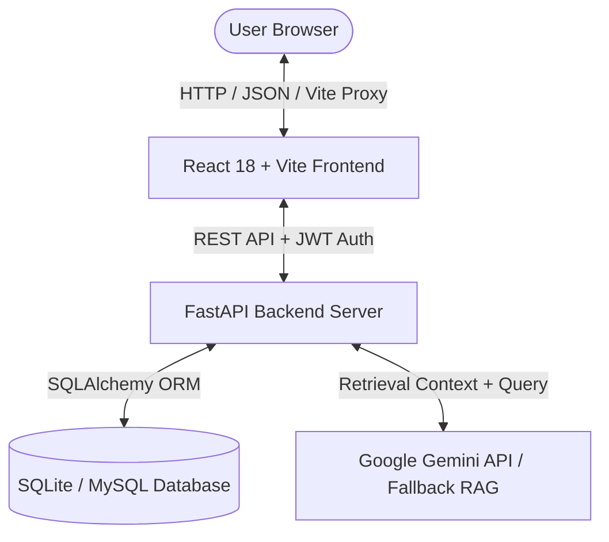

# 🏢 IntelliOffice (OfficeGen AI) — Intelligent Enterprise Management System

[](https://github.com/deepikag5208-sys/IntelliOffice)
[](https://fastapi.tiangolo.com/)
[](https://react.dev/)
[](https://vitejs.dev/)
[](https://tailwindcss.com/)
[](https://ai.google.dev/)

**IntelliOffice** is a modern, full-stack Enterprise Office Management System powered by **FastAPI**, **React 18**, and **Google Gemini AI**. It combines automated corporate workflows, role-based access control, interactive data visualization, and an intelligent **Natural Language RAG (Retrieval-Augmented Generation) AI Assistant** with a responsive glassmorphic dark UI.

---

## 📸 Key Highlights & Features

### 📊 1. Executive Telemetry & Live Dashboard
- **Real-Time KPI Metric Cards**: Live tracking of Total Employees, Daily Attendance %, Pending Leave Requests, Open Tasks, Upcoming Meetings, and Broadcasts.
- **Interactive Analytics Visualizations**: Daily attendance trends and task priority distributions built with `Recharts`.
- **Glassmorphic UI**: Ambient mesh gradient lighting, smooth card elevations, and responsive dark theme styling.

### 🤖 2. RAG-Enabled Natural Language AI Assistant
- **Context-Aware Database Retrieval**: Answers questions like *"What are my pending tasks?"*, *"How many leaves do I have?"*, or *"Show today's meetings"* by retrieving live records from SQLite/SQLAlchemy.
- **Dual-Mode Engine**: Powered by Google Gemini (`gemini-1.5-flash`) with an instant built-in local fallback synthesis engine.
- **Role Boundary Enforcement**: Respects user permissions (Employees only access their own private data, while Admins/Managers access organization metrics).

### 👥 3. Staff Directory & Role-Based Profiles
- **Three-Tier Role Security**: Dedicated permissions for **Admin**, **Manager**, and **Employee**.
- **Real-time Filter & Search**: Instant lookup by employee name, employee code (`EMP-001`), designation, or department.

### ⏱️ 4. Attendance Tracker & Punch Clock
- **One-Click Check-In / Check-Out**: Status calculations (`Present`, `Late`, `Absent`) and live duration computation.
- **Attendance History Logs**: Detailed daily punch logs and department presence summaries.

### 🌴 5. Leave Management & Approval Hub
- **Employee Request Submission**: Casual, Sick, and Paid leave requests with date range pickers and reason notes.
- **Manager Review System**: Approve or Reject requests with live balance deductions.

### 📋 6. Task Management & Kanban Board
- **Visual Task Pipeline**: Status columns (`To Do`, `In Progress`, `Completed`).
- **Priority Badging**: Urgent, High, Medium, and Low tags with assignee metadata and due dates.

### 📅 7. Meeting Scheduler & Video Launcher
- **Meeting Organization**: Schedule board meetings, set start/end times, and assign participants.
- **One-Click Join**: Quick launcher for Google Meet, Zoom, or Microsoft Teams links.

### 📢 8. Office Announcements & Broadcasts
- **Notice Board**: High-priority alert banner and company-wide notifications.

### 📁 9. Document Catalog & Executive Reports
- **Document Management**: File upload catalog and download portal for company handbooks and policies.
- **Exportable Analytics**: Aggregated system reporting with instant **CSV Export** and printable summary layouts.

---

## 🛠️ Technology Stack & Architecture



| Layer | Technologies Used |
| :--- | :--- |
| **Frontend UI** | React 18, Vite 5, React Router v6, Tailwind CSS v3, Lucide Icons |
| **Data Visualization** | Recharts |
| **Backend REST API** | Python 3.9+, FastAPI, Uvicorn, Pydantic v2 |
| **Database & ORM** | SQLAlchemy 2.0, SQLite (MySQL-ready via PyMySQL) |
| **Authentication & Security** | OAuth2 Password Bearer, JWT (JSON Web Tokens), Passlib Bcrypt |
| **AI / NLP Engine** | Google Generative AI (Gemini 1.5 Flash) + Local RAG Synthesizer |

---

## 🚀 Quick Start Guide

### Prerequisites
- [Python](https://www.python.org/) (v3.9 or higher)
- [Node.js](https://nodejs.org/) (v18 or higher) & `npm`

---

### 1️⃣ Clone the Repository

```bash
git clone https://github.com/deepikag5208-sys/IntelliOffice.git
cd IntelliOffice
```

---

### 2️⃣ Backend Setup (FastAPI)

```bash
# Navigate to backend directory
cd backend

# Install dependencies
pip install -r requirements.txt

# Start the FastAPI server (Runs on http://localhost:8000)
python run.py
```

- **API Base URL**: `http://localhost:8000`
- **Swagger Interactive Docs**: `http://localhost:8000/docs`
- **Redoc Documentation**: `http://localhost:8000/redoc`

*(Optional) Configure Gemini API key by creating a `backend/.env` file:*
```env
GEMINI_API_KEY=your_google_gemini_api_key_here
```

---

### 3️⃣ Frontend Setup (React + Vite)

```bash
# In a new terminal, navigate to frontend directory
cd frontend

# Install Node modules
npm install

# Start Vite live development server (Runs on http://localhost:3000)
npm run dev
```

- **Frontend Application**: `http://localhost:3000`

---

## 🔐 Demo Credentials

Use any of the pre-configured accounts to explore role-specific permissions:

| Role | Email | Password | Permissions |
| :--- | :--- | :--- | :--- |
| 🛡️ **Admin** | `admin@office.com` | `admin123` | Full access: Employees, Reports, System Settings, Tasks, Leaves |
| 👔 **Manager** | `manager@office.com` | `manager123` | Department Management: Approve/Reject Leaves, Tasks, Meetings |
| 👤 **Employee** | `employee@office.com` | `employee123` | Personal Dashboard, Check-In/Out, My Tasks, AI Assistant |

---

## 📁 Project Structure

```text
IntelliOffice/
├── backend/
│   ├── app/
│   │   ├── routes/              # REST Endpoints (auth, employees, attendance, AI, tasks...)
│   │   ├── services/            # AI RAG Service & automatic Database Seeder
│   │   ├── auth.py              # JWT authentication & password hashing
│   │   ├── config.py            # Environment & Pydantic application settings
│   │   ├── database.py          # SQLAlchemy engine & session factory
│   │   ├── models.py            # Database tables (Users, Attendance, Tasks, etc.)
│   │   └── schemas.py           # Pydantic schema validation
│   ├── uploads/                 # Static document uploads directory
│   ├── requirements.txt         # Python dependencies
│   └── run.py                   # FastAPI server entry point
├── frontend/
│   ├── src/
│   │   ├── components/          # Reusable UI components (Sidebar, Header, StatCard, Modals)
│   │   ├── context/             # AuthContext provider
│   │   ├── pages/               # Views (Dashboard, Staff, Attendance, Tasks, AI Assistant)
│   │   ├── services/            # Axios API client
│   │   ├── App.jsx              # Routing & root layout wrapper
│   │   └── index.css            # Custom CSS & glassmorphic styling
│   ├── package.json             # NPM package definitions
│   ├── tailwind.config.js       # Tailwind CSS theme configuration
│   └── vite.config.js           # Vite server & API proxy config
└── README.md                    # Project documentation
```

---

## 📜 License

Distributed under the **MIT License**. Feel free to use and modify for enterprise or personal projects.
